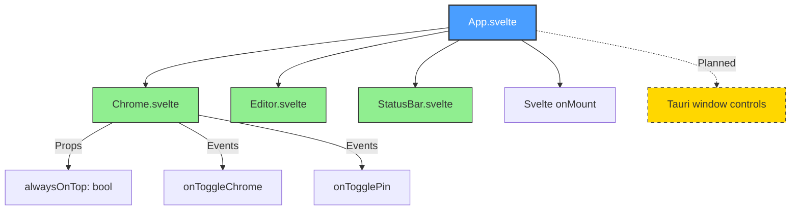

# App.svelte Architecture

> **Source File**: [`src/App.svelte`](../../../src/App.svelte)
> **Status**: ✅ Implemented
> **Component Type**: Root Application Container
> **Lines of Code**: 87

---

## Table of Contents

- [Overview](#overview)
- [Purpose](#purpose)
- [Integration Points](#integration-points)
- [Component Dependencies](#component-dependencies)
- [Architecture Diagram](#architecture-diagram)
- [State Management](#state-management)
- [Styling System](#styling-system)
- [Related Documentation](#related-documentation)

---

## Overview

`App.svelte` serves as the root application component for Skretchpad. It orchestrates the layout structure, manages top-level UI state (chrome visibility, always-on-top), and applies the initial glass theme to the application.

### Key Responsibilities

- **Layout Management**: Coordinates the three main UI sections (Chrome, Editor, StatusBar)
- **Theme Initialization**: Applies default liquid glass theme on mount
- **Chrome Toggle**: Controls visibility of the title bar
- **Window Pinning**: Manages always-on-top window state (planned)
- **Global CSS Coordination**: Sets up glass effects and backdrop filters

---

## Purpose

### Why This Component Exists

1. **Root Container**: Provides the foundational layout structure for the entire application
2. **UI Orchestration**: Manages visibility and interaction between major UI components
3. **Theme Bootstrap**: Initializes the visual appearance before theme engine loads
4. **Window Controls**: Central point for window-level behaviors (chrome, pinning)
5. **Glass Effect Application**: Applies liquid glass visual effects to the window

### Design Goals

- Minimal complexity - delegates functionality to child components
- Centralized UI state for chrome visibility and window pinning
- Fast initial render with CSS variable-based theming
- Flexible layout using CSS flexbox

---

## Integration Points

### Child Components

| Component     | Source                                                                        | Purpose                        | Status          |
|---------------|-------------------------------------------------------------------------------|--------------------------------|-----------------|
| **Chrome**    | [`src/components/Chrome.svelte`](../../../src/components/Chrome.svelte)       | Title bar with window controls | [x] Implemented |
| **Editor**    | [`src/components/Editor.svelte`](../../../src/components/Editor.svelte)       | CodeMirror 6 editor container  | [x] Implemented |
| **StatusBar** | [`src/components/StatusBar.svelte`](../../../src/components/StatusBar.svelte) | Bottom status information bar  | [x] Implemented |

### External Dependencies

- **Svelte**: `onMount` lifecycle hook for theme initialization
- **Tauri** (Planned): Window control commands for always-on-top functionality

### Backend Integration (Planned)

- `set_always_on_top(enabled: bool)` - Tauri command for window pinning

---

## Component Dependencies

### Dependency Map



### Import Graph

```typescript
App.svelte
├─> import Editor from './components/Editor.svelte'
├─> import Chrome from './components/Chrome.svelte'
├─> import StatusBar from './components/StatusBar.svelte'
└─> import { onMount } from 'svelte'
```

---

## Architecture Diagram

### Component Hierarchy

```plaintext
┌──────────────────────────────────────────────────────────────┐
│                         APP.SVELTE                           │
│                    (Root Container - 87 LOC)                 │
└──────────────────────────────────────────────────────────────┘
                              │
          ┌───────────────────┼───────────────────┐
          │                   │                   │
          ▼                   ▼                   ▼
┌─────────────────┐  ┌─────────────────┐  ┌─────────────────┐
│  Chrome.svelte  │  │ Editor.svelte   │  │StatusBar.svelte │
│   (Title Bar)   │  │ (CodeMirror 6)  │  │  (Status Info)  │
├─────────────────┤  ├─────────────────┤  ├─────────────────┤
│ Props:          │  │ • File editing  │  │ • File info     │
│ • alwaysOnTop   │  │ • Syntax HL     │  │ • Cursor pos    │
│                 │  │ • Themes        │  │ • Language      │
│ Events:         │  │ • Plugins       │  │ • Plugin items  │
│ • toggleChrome  │  └─────────────────┘  └─────────────────┘
│ • togglePin     │
└─────────────────┘
         │
         │ (Planned Integration)
         ▼
┌─────────────────────────────────────────┐
│      TAURI BACKEND COMMANDS             │
├─────────────────────────────────────────┤
│ • set_always_on_top(enabled: bool)      │
│ • get_window_state() -> WindowState     │
└─────────────────────────────────────────┘
```

### Layout Structure

```plaintext
┌──────────────────────────────────────────────────────────────┐
│ .app.glass-window (100vw × 100vh)                            │
│ ┌──────────────────────────────────────────────────────────┐ │
│ │ Chrome.svelte (conditional: {#if chromeVisible})         │ │
│ │ • Window controls                                        │ │
│ │ • Menu bar                                               │ │
│ │ • Pin button                                             │ │
│ └──────────────────────────────────────────────────────────┘ │
│                                                              │
│ ┌──────────────────────────────────────────────────────────┐ │
│ │ .editor-container (flex: 1, min-height: 0)               │ │
│ │ ┌──────────────────────────────────────────────────────┐ │ │
│ │ │ Editor.svelte                                        │ │ │
│ │ │ • CodeMirror 6 editor                                │ │ │
│ │ │ • Syntax highlighting                                │ │ │
│ │ │ • File I/O                                           │ │ │
│ │ └──────────────────────────────────────────────────────┘ │ │
│ └──────────────────────────────────────────────────────────┘ │
│                                                              │
│ ┌──────────────────────────────────────────────────────────┐ │
│ │ StatusBar.svelte                                         │ │
│ │ • File information                                       │ │
│ │ • Cursor position                                        │ │
│ │ • Language mode                                          │ │
│ └──────────────────────────────────────────────────────────┘ │
└──────────────────────────────────────────────────────────────┘
```

---

## State Management

### Component State

| Variable        | Type      | Initial Value | Purpose                           |
|-----------------|-----------|---------------|-----------------------------------|
| `chromeVisible` | `boolean` | `true`        | Controls visibility of title bar  |
| `alwaysOnTop`   | `boolean` | `false`       | Window pin state (always-on-top)  |
| `currentFile`   | `string`  | `''`          | Currently open file path (unused) |

### State Flow

```plaintext
User Interaction
      │
      ├─> toggleChrome()
      │   └─> chromeVisible = !chromeVisible
      │       └─> Reactive update hides/shows Chrome component
      │
      └─> toggleAlwaysOnTop()
          └─> alwaysOnTop = !alwaysOnTop
              └─> [TODO] invoke('set_always_on_top', { enabled: alwaysOnTop })
                  └─> Tauri backend updates window state
```

---

## Styling System

### CSS Architecture

#### Global Styling

```css
:global(body) {
  margin: 0;
  padding: 0;
  background: transparent;
  font-family: -apple-system, BlinkMacSystemFont, 'Segoe UI', Roboto, sans-serif;
}

:global(html) {
  background: linear-gradient(135deg, #1e1e1e 0%, #2d2d2d 100%);
}
```

#### Component Styling

| Class               | Properties                                            | Purpose                                      |
|---------------------|-------------------------------------------------------|----------------------------------------------|
| `.app`              | `display: flex`, `flex-direction: column`             | Vertical layout container                    |
| `.glass-window`     | `backdrop-filter: blur(...)`, `background: rgba(...)` | Liquid glass visual effect                   |
| `.editor-container` | `flex: 1`, `min-height: 0`                            | Flexible editor area with scroll containment |

### CSS Variables (Theme System)

| Variable         | Default Value            | Purpose                                   |
|------------------|--------------------------|-------------------------------------------|
| `--window-bg`    | `rgba(18, 18, 18, 0.85)` | Window background color with transparency |
| `--window-blur`  | `20px`                   | Backdrop blur strength for glass effect   |
| `--editor-bg`    | `transparent`            | Editor background (inherits window glass) |
| `--editor-fg`    | `#e4e4e4`                | Editor foreground/text color              |
| `--cursor-color` | `#00d9ff`                | Cursor accent color (cyan)                |

### Theme Application

The `applyGlassTheme()` function runs on mount and sets CSS custom properties:

```typescript
function applyGlassTheme() {
  document.documentElement.style.setProperty('--window-bg', 'rgba(18, 18, 18, 0.85)');
  document.documentElement.style.setProperty('--window-blur', '20px');
  document.documentElement.style.setProperty('--editor-bg', 'transparent');
  document.documentElement.style.setProperty('--editor-fg', '#e4e4e4');
  document.documentElement.style.setProperty('--cursor-color', '#00d9ff');
}
```

> **Note**: This is a temporary bootstrap theme. Will be replaced by [`src-tauri/src/theme_engine.rs`](../../../src-tauri/src/theme_engine.rs) theme loading system.

---

## Related Documentation

### Core Documentation

- **[Project Overview](../1_overview.md)** - High-level architecture and design goals
- **[Tech Stack](../2_techstack.md)** - Technologies and frameworks used
- **[Technical Details](../3_technical-details.md)** - In-depth implementation details
- **[Configuration](../4_configs.md)** - Configuration file formats and options

### Component Documentation

- **[Chrome.svelte Documentation](Chrome.svelte.md)** - Title bar component (to be created)
- **[Editor.svelte Documentation](2_Editor.svelte.md)** - Main editor component
- **[StatusBar.svelte Documentation](StatusBar.svelte.md)** - Status bar component (to be created)

### Related Modules

- **[Theme Engine (theme_engine.rs)](../../../src-tauri/src/theme_engine.rs)** - Backend theme loading
- **[Main TypeScript (main.ts)](4_main.ts.md)** - Frontend entry point

### Project Status

- **[STATUS.md](../../STATUS.md)** - Module development progress tracker
- **[TODO.md](../../TODO.md)** - Implementation tasks and issue resolution
- **[Directory Tree](../0_directory-tree.md)** - Complete project structure

---

## Source Code Reference

**File**: [`src/App.svelte`](../../../src/App.svelte:1)

### Component Structure

```svelte
<script lang="ts">
  import Editor from './components/Editor.svelte';
  import Chrome from './components/Chrome.svelte';
  import StatusBar from './components/StatusBar.svelte';
  import { onMount } from 'svelte';

  let chromeVisible = true;
  let alwaysOnTop = false;
  let currentFile = '';

  onMount(() => {
    applyGlassTheme();
  });

  function toggleChrome() { /* ... */ }
  function toggleAlwaysOnTop() { /* ... */ }
  function applyGlassTheme() { /* ... */ }
</script>

<div class="app glass-window">
  {#if chromeVisible}
    <Chrome {alwaysOnTop} {onToggleChrome} {onTogglePin} />
  {/if}
  <div class="editor-container">
    <Editor />
  </div>
  <StatusBar />
</div>

<style>
  /* Glass effect styling */
</style>
```

---

## Future Enhancements

### Planned Features

1. **Backend Integration**
   - [ ] Implement `set_always_on_top` Tauri command
   - [ ] Add window state persistence
   - [ ] Integrate with theme engine for dynamic theme loading

2. **State Management**
   - [ ] Move to Svelte stores for global state
   - [ ] Add window position/size persistence
   - [ ] Implement theme switching UI

3. **Component Communication**
   - [ ] Event bus for component messaging
   - [ ] Plugin system integration hooks
   - [ ] Command palette integration

### Technical Debt

- `currentFile` variable is declared but unused (line 9)
- `toggleAlwaysOnTop` has TODO comment - needs Tauri integration
- Hardcoded theme values should be moved to theme system

---

**Last Updated**: 2025-10-28
**Documentation Version**: 1.0.0
**Component Version**: 0.1.0
