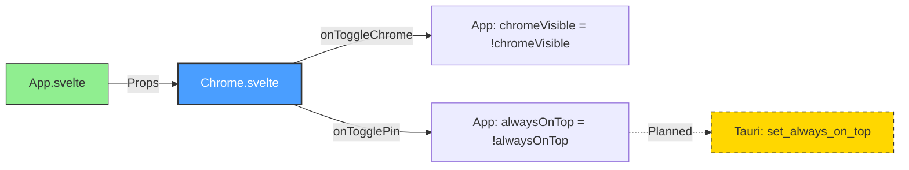

# Chrome.svelte Architecture

> **Source File**: [`src/components/Chrome.svelte`](../../../src/components/Chrome.svelte)
> **Status**: ✅ Implemented
> **Component Type**: Title Bar / Window Controls
> **Lines of Code**: 125

---

## Table of Contents

- [Overview](#overview)
- [Purpose](#purpose)
- [Component API](#component-api)
- [Integration Points](#integration-points)
- [Architecture Diagram](#architecture-diagram)
- [UI Structure](#ui-structure)
- [Styling System](#styling-system)
- [Related Documentation](#related-documentation)

---

## Overview

`Chrome.svelte` provides the custom title bar and window controls for Skretchpad. It features macOS-style traffic light buttons, a centered application title, and action buttons for chrome toggling and window pinning.

### Key Responsibilities

- **Window Controls**: macOS-style minimize, maximize, and close buttons
- **Application Branding**: Displays "skretchpad" title in the center
- **Chrome Toggle**: Button to hide/show the title bar itself
- **Pin Toggle**: Button to enable/disable always-on-top window mode
- **Visual Consistency**: Maintains glass effect theme with backdrop blur

---

## Purpose

### Why This Component Exists

1. **Custom Window Decorations**: Provides branded, consistent window controls across platforms
2. **Chrome Toggle Feature**: Enables distraction-free mode by hiding the title bar
3. **Window Management**: Centralizes window control actions (minimize, maximize, close, pin)
4. **Visual Polish**: Applies glass effect and smooth animations to window chrome
5. **User Control**: Gives users quick access to window state toggles

### Design Goals

- **Minimal Footprint**: Only 32px tall to maximize editor space
- **Platform Consistency**: macOS-inspired design regardless of platform
- **Visual Feedback**: Hover states and active indicators for all buttons
- **Accessibility**: Clear button labels via emoji icons and title attributes

---

## Component API

### Props

| Prop | Type | Required | Default | Description |
|------|------|----------|---------|-------------|
| `alwaysOnTop` | `boolean` | No | `false` | Indicates if window is pinned (always-on-top) |
| `onToggleChrome` | `() => void` | Yes | - | Callback to toggle chrome visibility |
| `onTogglePin` | `() => void` | Yes | - | Callback to toggle always-on-top state |

### Events

This component doesn't emit custom events; it uses callback props instead.

### Public API

```typescript
export interface ChromeProps {
  alwaysOnTop?: boolean;
  onToggleChrome: () => void;
  onTogglePin: () => void;
}
```

---

## Integration Points

### Parent Component

| Component | Relationship | Data Flow |
|-----------|--------------|-----------|
| **[App.svelte](0_App.svelte.md)** | Parent | Passes props and event handlers |

### External Dependencies

- **Svelte**: Reactive class bindings (`class:pinned`)

### Backend Integration (Planned)

- Window minimize/maximize/close actions will trigger Tauri window commands
- Pin button currently triggers parent callback but needs Tauri integration

---

## Architecture Diagram

### Component Hierarchy

```plaintext
┌──────────────────────────────────────────────────────────────┐
│                      CHROME.SVELTE                           │
│                  (Title Bar - 125 LOC)                       │
└──────────────────────────────────────────────────────────────┘
                              │
          ┌───────────────────┼───────────────────┐
          │                   │                   │
          ▼                   ▼                   ▼
┌─────────────────┐  ┌─────────────────┐  ┌─────────────────┐
│ .window-controls│  │     .title      │  │.chrome-actions  │
│   (Left Side)   │  │    (Center)     │  │  (Right Side)   │
├─────────────────┤  ├─────────────────┤  ├─────────────────┤
│ • Minimize (−)  │  │ "skretchpad"    │  │ • Pin (📌)      │
│ • Maximize (□)  │  │                 │  │ • Hide (👁)     │
│ • Close (×)     │  │                 │  │                 │
└─────────────────┘  └─────────────────┘  └─────────────────┘
         │                                          │
         │                                          │
         ▼                                          ▼
┌─────────────────────────────────────────────────────────────┐
│              TAURI BACKEND COMMANDS (Planned)               │
├─────────────────────────────────────────────────────────────┤
│ • minimize_window()                                         │
│ • maximize_window()                                         │
│ • close_window()                                            │
│ • set_always_on_top(enabled: bool)                          │
└─────────────────────────────────────────────────────────────┘
```

### Data Flow



---

## UI Structure

### Layout Breakdown

```plaintext
┌──────────────────────────────────────────────────────────────┐
│ .chrome (32px height, glass effect)                          │
│ ┌──────────────────────────────────────────────────────────┐ │
│ │ .title-bar (flexbox: space-between)                      │ │
│ │                                                          │ │
│ │  ┌───────────┐        ┌──────┐        ┌──────────────┐  │ │
│ │  │  .window- │        │.title│        │ .chrome-     │  │ │
│ │  │  controls │        │      │        │ actions      │  │ │
│ │  ├───────────┤        ├──────┤        ├──────────────┤  │ │
│ │  │ [−] [□] [×]│        │ skre-│        │  [📌] [👁]   │  │ │
│ │  │            │        │tchpad│        │              │  │ │
│ │  └───────────┘        └──────┘        └──────────────┘  │ │
│ │                                                          │ │
│ └──────────────────────────────────────────────────────────┘ │
└──────────────────────────────────────────────────────────────┘
```

### Button Layout

| Section | Buttons | Purpose | Status |
|---------|---------|---------|--------|
| **Window Controls** | Minimize (−) | Minimize window | 📋 Needs Tauri integration |
| | Maximize (□) | Maximize/restore window | 📋 Needs Tauri integration |
| | Close (×) | Close application | 📋 Needs Tauri integration |
| **Chrome Actions** | Pin (📌) | Toggle always-on-top | ✅ Callback implemented |
| | Hide (👁) | Toggle chrome visibility | ✅ Implemented |

---

## Styling System

### CSS Architecture

#### Container Styling

```css
.chrome {
  background: rgba(28, 28, 28, 0.95);  /* Semi-transparent dark */
  backdrop-filter: blur(10px);          /* Glass blur effect */
  border-bottom: 1px solid rgba(255, 255, 255, 0.1);
  height: 32px;
  user-select: none;                    /* Prevent text selection */
}
```

#### Window Control Buttons (macOS Style)

| Button | Color | Symbol | Shortcut |
|--------|-------|--------|----------|
| Minimize | `#ffbd2e` (Yellow) | − | - |
| Maximize | `#27ca3f` (Green) | □ | - |
| Close | `#ff5f56` (Red) | × | - |

```css
.control-button {
  width: 12px;
  height: 12px;
  border-radius: 50%;           /* Circular buttons */
  cursor: pointer;
  font-size: 8px;
}
```

#### Action Buttons

```css
.action-button {
  background: transparent;
  color: rgba(228, 228, 228, 0.7);
  transition: all 0.2s ease;
}

.action-button:hover {
  background: rgba(255, 255, 255, 0.1);
  color: rgba(228, 228, 228, 1);
}

.action-button.pinned {
  color: #00d9ff;                /* Cyan accent when active */
}
```

### Reactive Styling

The component uses Svelte's reactive class binding for the pin button state:

```svelte
<button
  class="action-button"
  class:pinned={alwaysOnTop}
  on:click={handleTogglePin}
>
  📌
</button>
```

When `alwaysOnTop` is `true`, the `.pinned` class applies cyan color (`#00d9ff`).

---

## Source Code Reference

**File**: [`src/components/Chrome.svelte`](../../../src/components/Chrome.svelte:1)

### Component Structure

```svelte
<script lang="ts">
  export let alwaysOnTop = false;
  export let onToggleChrome: () => void;
  export let onTogglePin: () => void;

  function handleToggleChrome() {
    onToggleChrome();
  }

  function handleTogglePin() {
    onTogglePin();
  }
</script>

<div class="chrome">
  <div class="title-bar">
    <!-- Window Controls -->
    <div class="window-controls">
      <button class="control-button minimize">−</button>
      <button class="control-button maximize">□</button>
      <button class="control-button close">×</button>
    </div>

    <!-- App Title -->
    <div class="title">skretchpad</div>

    <!-- Chrome Actions -->
    <div class="chrome-actions">
      <button class:pinned={alwaysOnTop} on:click={handleTogglePin}>📌</button>
      <button on:click={handleToggleChrome}>👁</button>
    </div>
  </div>
</div>
```

---

## Related Documentation

### Core Documentation

- **[Project Overview](../1_overview.md)** - High-level architecture and design goals
- **[Tech Stack](../2_techstack.md)** - Technologies and frameworks used
- **[Technical Details](../3_technical-details.md)** - In-depth implementation details

### Component Documentation

- **[App.svelte Documentation](0_App.svelte.md)** - Parent root component
- **[Editor.svelte Documentation](2_Editor.svelte.md)** - Main editor component
- **[StatusBar.svelte Documentation](StatusBar.svelte.md)** - Status bar component (to be created)

### Project Status

- **[STATUS.md](../../STATUS.md)** - Module development progress tracker
- **[TODO.md](../../TODO.md)** - Implementation tasks and issue resolution

---

## Future Enhancements

### Planned Features

1. **Tauri Window Commands Integration**
   - [ ] Implement minimize button → `invoke('minimize_window')`
   - [ ] Implement maximize button → `invoke('maximize_window')`
   - [ ] Implement close button → `invoke('close_window')`
   - [ ] Connect pin button to `invoke('set_always_on_top', { enabled })`

2. **Enhanced Window Controls**
   - [ ] Add double-click title bar to maximize
   - [ ] Add drag-to-move functionality on title bar
   - [ ] Platform-specific button layouts (Windows vs macOS)

3. **Additional Actions**
   - [ ] Menu dropdown button
   - [ ] Settings/preferences button
   - [ ] Quick theme switcher in chrome

4. **Visual Enhancements**
   - [ ] Smooth show/hide animation for chrome
   - [ ] Glow effect on hover for traffic lights
   - [ ] Animated transitions for pin state

### Technical Debt

- Window control buttons are visual only - no functionality
- No keyboard shortcuts implemented (only shown in title attributes)
- No drag-to-move window functionality
- No double-click to maximize

---

## Implementation Notes

### Cross-Platform Considerations

Currently, the component uses macOS-style traffic lights on all platforms. Future versions should:

1. Detect platform via Tauri
2. Apply platform-specific styles:
   - **macOS**: Traffic lights (left side)
   - **Windows**: Minimize/Maximize/Close (right side, different style)
   - **Linux**: Configurable based on DE (GNOME, KDE, etc.)

### Accessibility

- All buttons have `title` attributes for tooltips
- Color contrast meets WCAG AA standards
- Consider adding ARIA labels for screen readers

---

**Last Updated**: 2025-10-28
**Documentation Version**: 1.0.0
**Component Version**: 0.1.0
