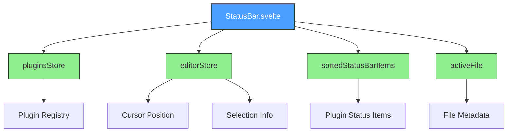
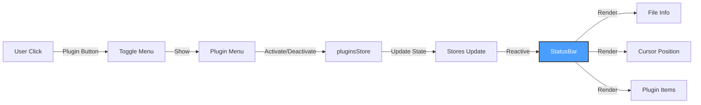

# StatusBar.svelte Architecture

> **Source File**: [`src/components/StatusBar.svelte`](../../../src/components/StatusBar.svelte)
> **Status**: ✅ Implemented
> **Component Type**: Status Bar / Plugin Integration UI
> **Lines of Code**: 322

---

## Table of Contents

- [Overview](#overview)
- [Purpose](#purpose)
- [Store Dependencies](#store-dependencies)
- [Integration Points](#integration-points)
- [Architecture Diagram](#architecture-diagram)
- [UI Structure](#ui-structure)
- [Plugin System Integration](#plugin-system-integration)
- [Styling System](#styling-system)
- [Related Documentation](#related-documentation)

---

## Overview

`StatusBar.svelte` provides the bottom status bar for Skretchpad, displaying file information, cursor position, plugin status items, and a plugin management menu. It serves as the primary UI integration point for the plugin system.

### Key Responsibilities

- **File Information Display**: Shows active file name, language, and dirty state
- **Cursor Position Tracking**: Displays line and column numbers in real-time
- **Plugin Status Items**: Renders status bar items contributed by plugins
- **Plugin Management UI**: Provides a popup menu for plugin activation/deactivation
- **Selection Information**: Shows character count when text is selected
- **Platform-Specific Formatting**: Handles macOS vs Windows shortcuts

---

## Purpose

### Why This Component Exists

1. **Plugin Integration Point**: Primary UI surface for plugins to display status information
2. **Editor Feedback**: Provides real-time feedback about cursor, selection, and file state
3. **Plugin Management**: User-friendly interface for managing plugin lifecycle
4. **Information Density**: Maximizes useful information in minimal vertical space (24px)
5. **Context Awareness**: Shows relevant information based on editor state

### Design Goals

- **Minimal Height**: Only 24px to maximize editor space
- **Clear Information Hierarchy**: Left = file info, Right = editor state
- **Plugin Extensibility**: Plugins can add status items with priority-based positioning
- **Visual Consistency**: Matches glass effect theme throughout application
- **Interactive Elements**: Clickable plugin items with tooltips and hover states

---

## Store Dependencies

### Svelte Store Imports

| Store | Source | Type | Purpose |
|-------|--------|------|---------|
| `pluginsStore` | [`$lib/stores/plugins`](13_plugins.ts.md) | `PluginStore` | Plugin registry and state management |
| `sortedStatusBarItems` | [`$lib/stores/plugins`](13_plugins.ts.md) | `Readable<StatusBarItem[]>` | Sorted plugin status bar items |
| `editorStore` | [`$lib/stores/editor`](12_editor.ts.md) | `EditorStore` | Editor state (cursor, selection) |
| `activeFile` | [`$lib/stores/editor`](12_editor.ts.md) | `Readable<FileInfo?>` | Active file metadata |

### Utility Imports

| Function | Source | Purpose |
|----------|--------|---------|
| `formatShortcut` | [`$lib/utils/ui`](15_ui.ts.md) | Format keyboard shortcuts for display |
| `isMac` | [`$lib/utils/ui`](15_ui.ts.md) | Detect macOS platform |

---

## Integration Points

### Parent Component

| Component | Relationship | Data Flow |
|-----------|--------------|-----------|
| **[App.svelte](0_App.svelte.md)** | Parent | No props - uses stores for state |

### Store Integration



### Backend Integration

- Indirectly uses plugin system via `pluginsStore`
- Calls plugin callbacks via `item.onClick()` handlers
- Triggers plugin lifecycle methods: `activate()`, `deactivate()`, `reload()`

---

## Architecture Diagram

### Component Structure

```plaintext
┌──────────────────────────────────────────────────────────────┐
│                    STATUSBAR.SVELTE                          │
│                 (Status Bar - 322 LOC)                       │
└──────────────────────────────────────────────────────────────┘
                              │
          ┌───────────────────┼───────────────────┐
          │                   │                   │
          ▼                   ▼                   ▼
┌─────────────────┐  ┌─────────────────┐  ┌─────────────────┐
│ .status-bar__   │  │ .status-bar__   │  │  .plugin-menu   │
│     left        │  │     right       │  │  (conditional)  │
├─────────────────┤  ├─────────────────┤  ├─────────────────┤
│ • File info     │  │ • Plugin items  │  │ • Plugin list   │
│ • Language      │  │ • Cursor pos    │  │ • Activate btn  │
│ • Dirty state   │  │ • Selection     │  │ • Deactivate    │
│ • Plugin items  │  │ • Plugin count  │  │ • Reload btn    │
│   (priority≥100)│  │   (priority<100)│  │ • Error display │
└─────────────────┘  └─────────────────┘  └─────────────────┘
         │                    │                     │
         ▼                    ▼                     ▼
┌──────────────────────────────────────────────────────────────┐
│                    SVELTE STORES                             │
├──────────────────────────────────────────────────────────────┤
│ • pluginsStore → Plugin registry & lifecycle                │
│ • editorStore → Cursor, selection, state                    │
│ • activeFile → File name, language, dirty flag              │
│ • sortedStatusBarItems → Plugin-contributed items           │
└──────────────────────────────────────────────────────────────┘
```

### Data Flow



---

## UI Structure

### Layout Breakdown

```plaintext
┌──────────────────────────────────────────────────────────────┐
│ .status-bar (24px height, glass effect)                      │
│ ┌──────────────────────────────────────────────────────────┐ │
│ │                                                          │ │
│ │  ┌───────────────────┐          ┌────────────────────┐  │ │
│ │  │ .status-bar__left │          │.status-bar__right  │  │ │
│ │  ├───────────────────┤          ├────────────────────┤  │ │
│ │  │ 📄 file.rs ●      │          │ [Git:main] [📊]    │  │ │
│ │  │ Rust              │          │ Ln 42, Col 12      │  │ │
│ │  │ [Plugin Items]    │          │ (5 selected)       │  │ │
│ │  │                   │          │ 🔌 3               │  │ │
│ │  └───────────────────┘          └────────────────────┘  │ │
│ │                                                          │ │
│ └──────────────────────────────────────────────────────────┘ │
└──────────────────────────────────────────────────────────────┘
```

### Status Bar Sections

| Section | Items | Alignment | Priority Filter |
|---------|-------|-----------|-----------------|
| **Left** | File info, Language, High-priority plugin items | Left | `priority >= 100` |
| **Right** | Low-priority plugin items, Cursor, Selection, Plugin count | Right | `priority < 100` |

### Plugin Menu Structure

```plaintext
┌──────────────────────────────────────────────────────────────┐
│ Plugins                                                      │
│ ┌──────────────────────────────────────────────────────────┐ │
│ │ ┌────────────────────────────────────────────────────┐   │ │
│ │ │ Git Plugin                           v1.0.0        │   │ │
│ │ │ ● active                                           │   │ │
│ │ │ [Deactivate] [Reload]                              │   │ │
│ │ └────────────────────────────────────────────────────┘   │ │
│ │                                                          │ │
│ │ ┌────────────────────────────────────────────────────┐   │ │
│ │ │ Syntax Analyzer                      v2.1.3        │   │ │
│ │ │ ● loaded                                           │   │ │
│ │ │ [Activate] [Reload]                                │   │ │
│ │ └────────────────────────────────────────────────────┘   │ │
│ │                                                          │ │
│ │ ┌────────────────────────────────────────────────────┐   │ │
│ │ │ Formatter                            v1.5.2        │   │ │
│ │ │ ● error                                            │   │ │
│ │ │ Error: Failed to load configuration                │   │ │
│ │ │ [Reload]                                           │   │ │
│ │ └────────────────────────────────────────────────────┘   │ │
│ └──────────────────────────────────────────────────────────┘ │
└──────────────────────────────────────────────────────────────┘
```

---

## Plugin System Integration

### Status Bar Item API

Plugins can contribute status bar items via the plugin store:

```typescript
interface StatusBarItem {
  id: string;           // Unique identifier
  text: string;         // Display text
  tooltip?: string;     // Hover tooltip
  color?: string;       // CSS color
  priority: number;     // Position (≥100 = left, <100 = right)
  onClick?: () => void; // Click handler
}
```

### Priority-Based Positioning

| Priority Range | Position | Use Case |
|----------------|----------|----------|
| `≥ 100` | Left side | File-related info, high importance |
| `< 100` | Right side | Editor state, low importance |

### Plugin Lifecycle States

| State | Indicator Color | Available Actions |
|-------|----------------|-------------------|
| `active` | Green (`#50fa7b`) | Deactivate, Reload |
| `loaded` | Cyan (`#00d9ff`) | Activate, Reload |
| `error` | Red (`#ff5555`) | Reload |

### Plugin Store Methods

```typescript
// Called from StatusBar
pluginsStore.activate(pluginId: string)
pluginsStore.deactivate(pluginId: string)
pluginsStore.reload(pluginId: string)
```

---

## Styling System

### CSS Variables

| Variable | Default | Purpose |
|----------|---------|---------|
| `--status-bar-height` | `24px` | Bar height |
| `--status-bar-bg` | Theme-dependent | Background color |
| `--status-bar-fg` | Theme-dependent | Text color |
| `--window-border-color` | Theme-dependent | Top border |
| `--button-hover` | Theme-dependent | Hover background |
| `--color-warning` | `#f1fa8c` | Dirty indicator |
| `--color-success` | `#50fa7b` | Active plugin indicator |
| `--color-error` | `#ff5555` | Error indicator |

### Responsive Item Styling

```css
.status-item {
  display: flex;
  align-items: center;
  gap: 4px;
  padding: 2px 8px;
  border-radius: 4px;
  transition: background 100ms;
}

.status-item--clickable:hover {
  background: var(--button-hover);
  cursor: pointer;
}
```

### Plugin Menu Overlay

```css
.plugin-menu {
  position: fixed;
  inset: 0;                           /* Full viewport overlay */
  background: rgba(0, 0, 0, 0.5);     /* Semi-transparent backdrop */
  z-index: 1000;                      /* Top layer */
}

.plugin-menu__content {
  max-height: 60vh;                   /* Scrollable if many plugins */
  overflow-y: auto;
  border-radius: 8px 8px 0 0;         /* Rounded top corners */
}
```

---

## Source Code Reference

**File**: [`src/components/StatusBar.svelte`](../../../src/components/StatusBar.svelte:1)

### Component Structure

```svelte
<script lang="ts">
  import { pluginsStore, sortedStatusBarItems } from '$lib/stores/plugins';
  import { editorStore, activeFile } from '$lib/stores/editor';
  import { formatShortcut, isMac } from '$lib/utils/ui';

  let showPluginMenu = false;

  $: cursorPosition = $editorStore.cursorPosition;
  $: fileInfo = $activeFile;
  $: pluginItems = $sortedStatusBarItems;

  function togglePluginMenu() { /* ... */ }
  function handleStatusBarItemClick(item) { /* ... */ }
</script>

<div class="status-bar">
  <div class="status-bar__left">
    <!-- File info + high-priority plugin items -->
  </div>
  <div class="status-bar__right">
    <!-- Low-priority plugin items + cursor + selection + plugin count -->
  </div>
</div>

{#if showPluginMenu}
  <div class="plugin-menu">
    <!-- Plugin management UI -->
  </div>
{/if}
```

### Reactive Statements

```typescript
// Cursor position from editor store
$: cursorPosition = $editorStore.cursorPosition;

// Active file information
$: fileInfo = $activeFile;

// Plugin-contributed status items (sorted by priority)
$: pluginItems = $sortedStatusBarItems;
```

---

## Related Documentation

### Core Documentation

- **[Project Overview](../1_overview.md)** - High-level architecture and design goals
- **[Tech Stack](../2_techstack.md)** - Technologies and frameworks used
- **[Technical Details](../3_technical-details.md)** - In-depth implementation details

### Component Documentation

- **[App.svelte Documentation](0_App.svelte.md)** - Parent root component
- **[Chrome.svelte Documentation](Chrome.svelte.md)** - Title bar component
- **[Editor.svelte Documentation](2_Editor.svelte.md)** - Main editor component

### Store Documentation

- **[plugins.ts Documentation](13_plugins.ts.md)** - Plugin store implementation
- **[editor.ts Documentation](12_editor.ts.md)** - Editor state store
- **[ui.ts Documentation](15_ui.ts.md)** - UI utility functions

### Plugin System

- **[plugin-api.ts Documentation](8_plugin-api.ts.md)** - Plugin API types and interfaces
- **[manager.rs Documentation](10_manager.rs.md)** - Backend plugin manager
- **[api.rs Documentation](3_api.rs.md)** - Tauri plugin commands

### Project Status

- **[STATUS.md](../../STATUS.md)** - Module development progress tracker
- **[TODO.md](../../TODO.md)** - Implementation tasks and issue resolution

---

## Future Enhancements

### Planned Features

1. **Enhanced File Information**
   - [ ] File encoding display (UTF-8, ASCII, etc.)
   - [ ] Line ending type (LF, CRLF)
   - [ ] File size indicator
   - [ ] Git branch integration (from git plugin)

2. **Plugin Status Improvements**
   - [ ] Plugin error details popup
   - [ ] Plugin settings access from menu
   - [ ] Plugin dependency visualization
   - [ ] Plugin performance metrics

3. **Context Menu Integration**
   - [ ] Right-click context menu on status items
   - [ ] Quick actions menu for plugins
   - [ ] Copy cursor position
   - [ ] Jump to line from cursor display

4. **Visual Enhancements**
   - [ ] Smooth slide-up animation for plugin menu
   - [ ] Status item badges for notifications
   - [ ] Customizable status bar colors per theme
   - [ ] Overflow menu for many status items

### Accessibility Improvements

- [ ] ARIA labels for all interactive elements
- [ ] Keyboard navigation for plugin menu
- [ ] Screen reader announcements for state changes
- [ ] High contrast mode support

---

## Implementation Notes

### Status Bar Item Filtering

Plugin items are filtered by priority for positioning:

```svelte
<!-- Left side: priority >= 100 -->
{#each pluginItems.filter(item => item.priority >= 100) as item}
  <!-- Render item -->
{/each}

<!-- Right side: priority < 100 -->
{#each pluginItems.filter(item => item.priority < 100) as item}
  <!-- Render item -->
{/each}
```

### Plugin State Management

The component directly interacts with the plugin store:

```typescript
// Activate a plugin
pluginsStore.activate(plugin.id)

// Deactivate a plugin
pluginsStore.deactivate(plugin.id)

// Reload a plugin
pluginsStore.reload(plugin.id)
```

### Click Event Delegation

Status bar items can define custom click handlers:

```typescript
function handleStatusBarItemClick(item: StatusBarItem) {
  if (item.onClick) {
    item.onClick();
  }
}
```

This allows plugins to define interactive status items (e.g., Git branch switcher).

---

**Last Updated**: 2025-10-28
**Documentation Version**: 1.0.0
**Component Version**: 0.1.0
